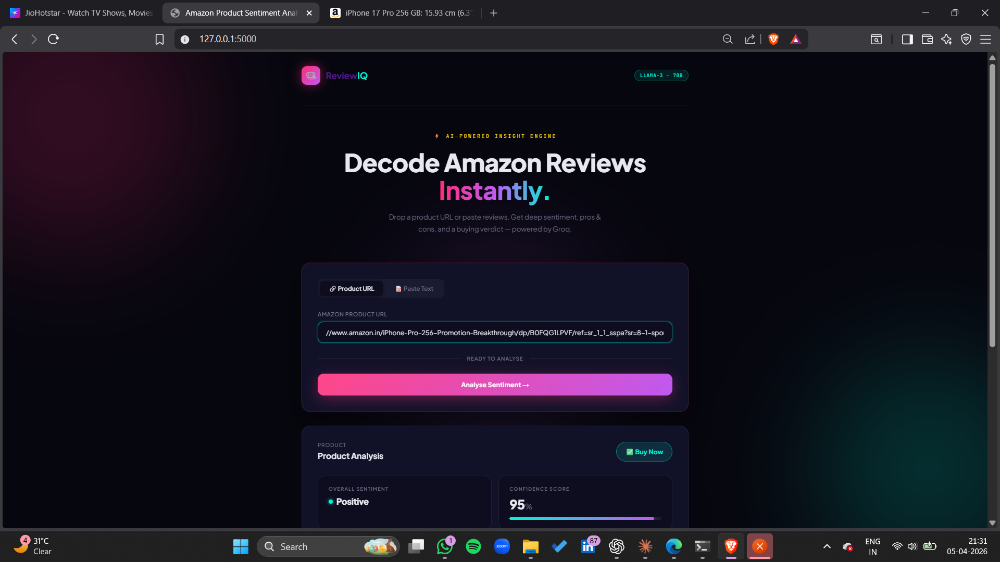
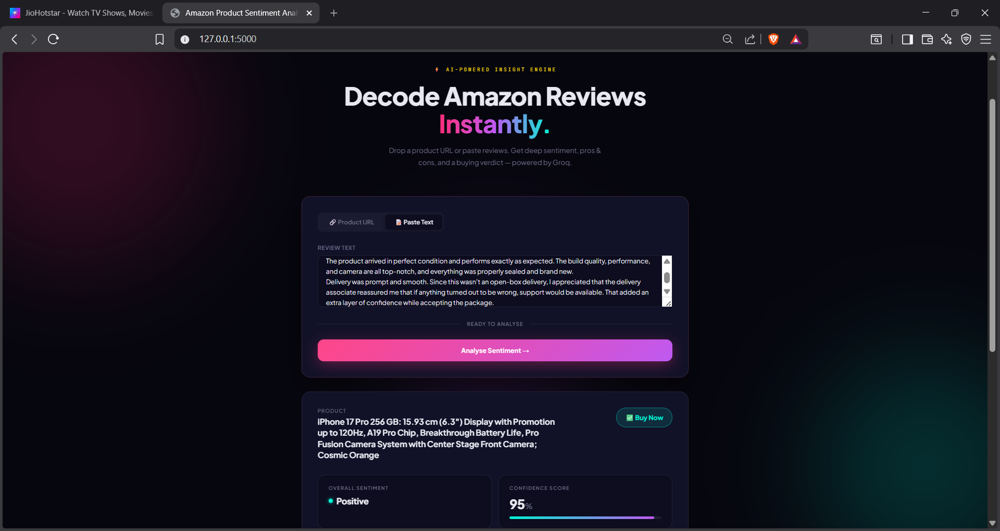
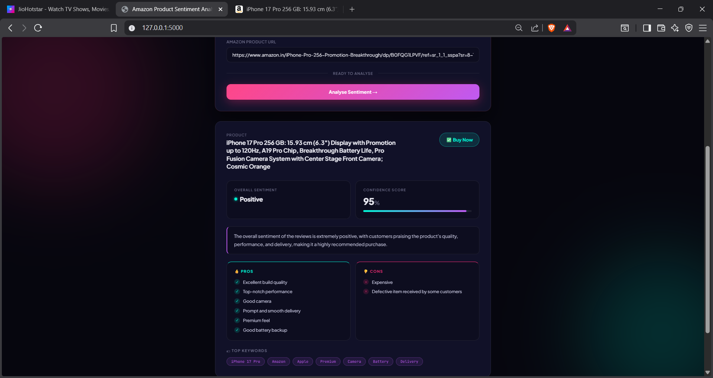
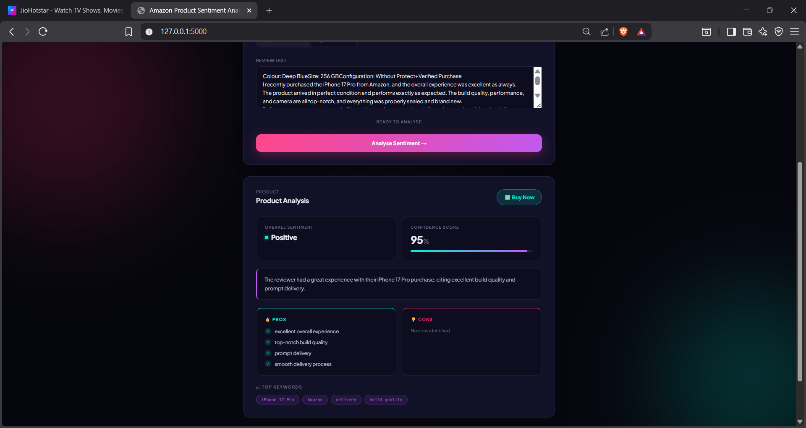
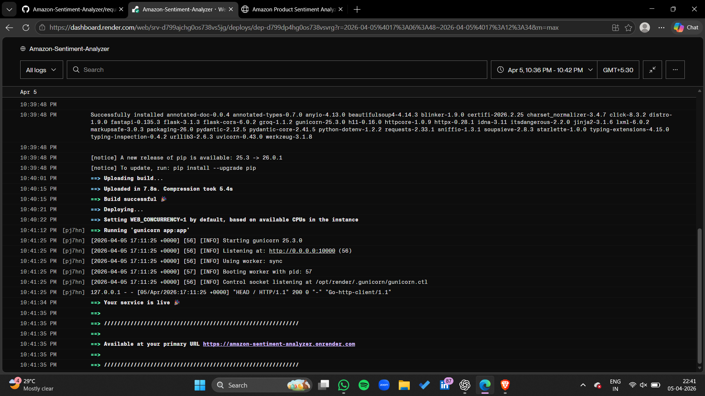
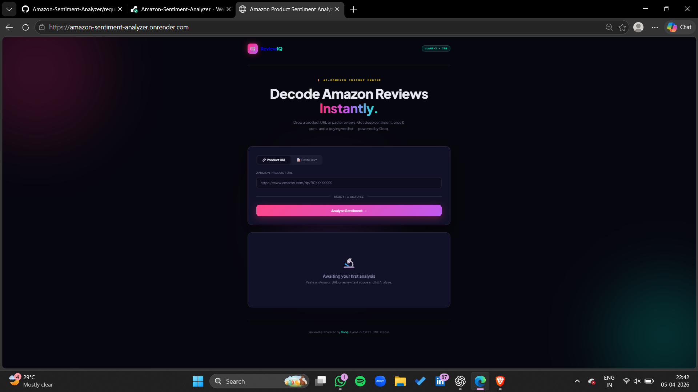
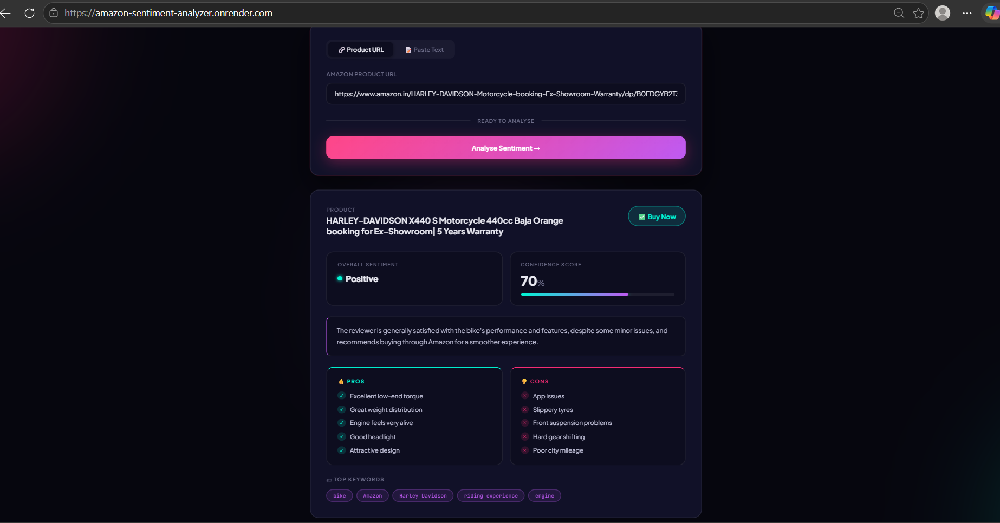
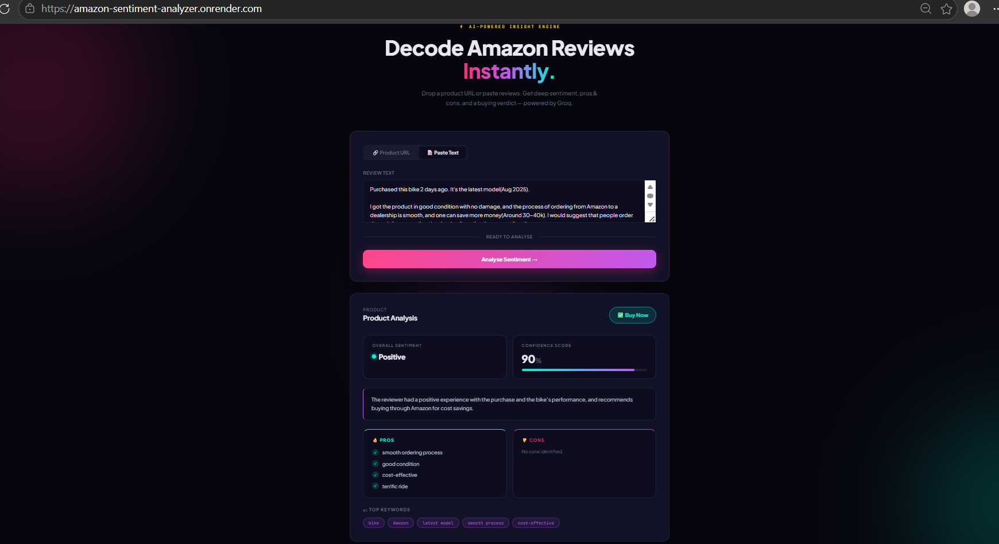

# 🛒 Amazon Sentiment & Review Analyzer 

> 🚀 A production-ready AI-powered analytics dashboard that extracts actionable insights from Amazon product reviews using advanced NLP and LLM reasoning.

## ✨ Overview

The **Amazon Sentiment Analyzer (Pro)** is a full-stack intelligent system that:
- Scrapes real-time product reviews 📦  
- Performs deep sentiment analysis 🧠  
- Extracts structured insights (Pros / Cons)  
- Generates a final buying recommendation  

Built with a dual-backend architecture, this project is designed for both users and developers.

## 🔥 Core Highlights

### ⚡ Dual Backend Architecture
- **Flask (SSR)** → Fast UI rendering  
- **FastAPI** → High-performance API  

### 🤖 Advanced AI Engine
- Powered by **Groq Llama-3-70B**
- Context-aware sentiment detection  
- Human-like reasoning  

### 🌐 Real-Time Amazon Scraper
- Live review extraction  
- Fallback handling  
- Clean preprocessing  

### 🛍️ Insight Engine
- Sentiment classification  
- Pros & Cons extraction  
- Verdict generation:
  - Buy Now  
  - Avoid  
  - Wait  
  - Research  

### 🎨 Modern UI
- Glassmorphism dashboard  
- Responsive design  
- Clean layout
  
## 🧰 Tech Stack

| Category | Technologies |
|----------|-------------|
| Backend | Python, Flask, FastAPI |
| AI | Groq (Llama-3-70B) |
| Scraping | BeautifulSoup4, Requests |
| Frontend | HTML, CSS |
| Data | JSON, Text Processing |

## 🚀 Live Demo

🔗 Add your deployed link here  
Example: https://amazon-sentiment-analyzer.onrender.com/

## 📸 Screenshots

### 🏠 Home Dashboard

### 📊 Sentiment Result

### 👍 Pros & 👎 Cons

## 📸 Live Application Screenshots

### 🏠 Home Interface

### 🔗 URL Input

### 📊 Sentiment Analysis Output

### 🛍️ AI Verdict (Pros & Cons)

## ⚙️ Installation

### 1. Clone Repository
git clone https://github.com/Harika-Satti/Amazon-Sentiment-Analyzer.git
cd Amazon-Sentiment-Analyzer

##  2. Create Virtual Environment
python -m venv venv
venv\Scripts\activate

##  3. Install Requirements
pip install -r requirements.txt

## 4. Setup Environment Variables

Create a .env file in the root directory:
GROQ_API_KEY=your_api_key_here

## ▶️ Run Application
Flask App
python app.py
Open: http://127.0.0.1:5000

FastAPI App
python main.py
Docs: http://127.0.0.1:8000/docs

## 📊 Sample Output
Product: Wireless Headphones

Sentiment: Positive
Pros:
- Great sound quality
- Long battery life
Cons:
- Expensive
- Average mic
Verdict: BUY NOW

## 🧠 Architecture
User Input (Amazon URL)
        ↓
Web Scraper
        ↓
Text Processing
        ↓
Groq LLM
        ↓
Insights (Pros/Cons/Verdict)
        ↓
UI Dashboard / API Response

## 🛣️ Roadmap

 Sentiment Analysis

 FastAPI Integration

 Live Scraping

 Dual Backend

 Multi-product comparison

 Export reports (PDF)

## 💼 Use Cases

Smart product decision-making
E-commerce analytics
NLP/LLM applications
Resume-ready AI project

## 🤝 Contributing

Feel free to fork this project and submit pull requests.

## 📜 License

MIT License

## 👩‍💻 Author
Harika Satti
Aspiring Data Scientist

